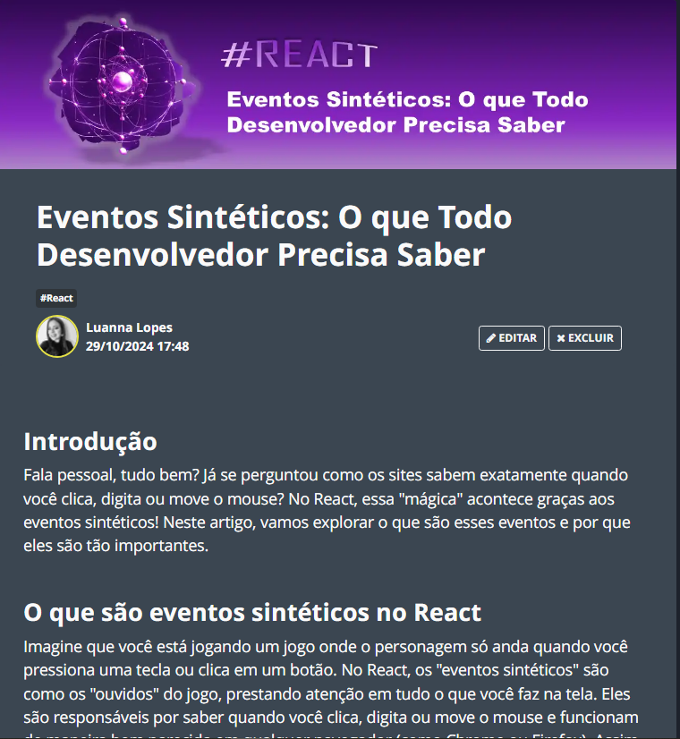

#  Projeto artigo técnico gerado por I.A.s

    

 > **NOTE:** Este é o repositório para entrega do projeto do curso de chatGPT dado as aulas e instruções pelo professor Felipe Aguiar na plataforma da [DIO](https://dio.me).
> 
Projeto com o objetivo de gerar um artigo técnico com um layout rico, leitura agradável e com foco em promover sua autoridade técnica.

    

<a href="https://web.dio.me/articles/eventos-sinteticos-o-que-todo-desenvolvedor-precisa-saber?back=%2Farticles&page=1&order=oldest" title="View PDF now"> 📕Clique aqui para ler o artigo align="center"</a>

## 💻 Tecnologias utilizadas no projeto

- [ChatGPT](https://chat.openai.com/) - para título e conteúdo
- [Lexica.art](https://lexica.art/) - para gerar imagens
- [PowerPoint](https://www.microsoft.com/en/microsoft-365/powerpoint) - Para formatação de banners e Layouts

## 📄 Prompts 

ChatGPT：

|   Ação   | prompt                                                                                                                                                                                                                                                                         |
| :------: | ------------------------------------------------------------------------------------------------------------------------------------------------------------------------------------------------------------------------------------------------------------------------------ |
|  título  | Crie 10 headlines para nomes de artigos sobre o assunto Eventos Sintéticos no React  |                                                                                                                                                                                             
| conteúdo | Comporte-se como um escritor de artigos tech front-end e escreva o artigo {Regras}, no máximo 5 linhas por blocos de explicação, Me explique de maneira informal, como se eu fosse uma criança de 10 anos |

## 🛠️ Ferramentas

Lexica.art：
- No léxica foi utilizado o acervo público de imagens geradas por outras pessoas;
  
PowerPoint:
- No PowerPoint foi usado para ajustar e criar a capa para o artigo;

chatGPT:
- Conteúdo gerado via ChatGPT
  